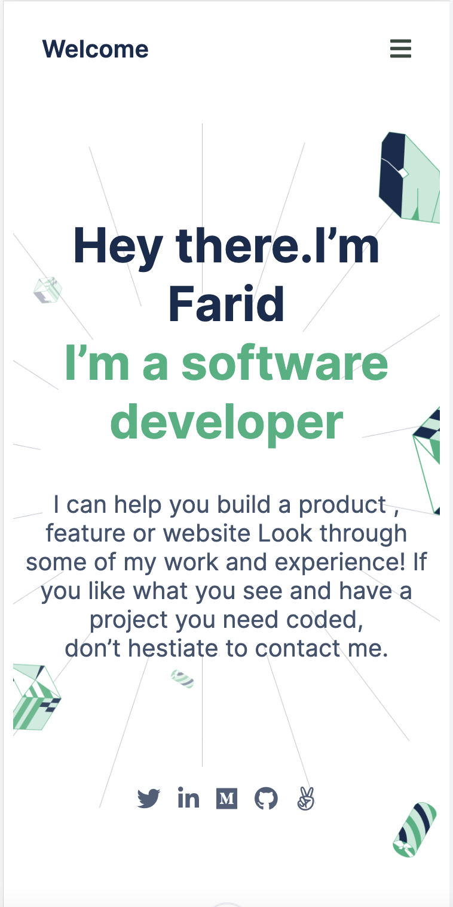

# My-Portfolio

This is My personal portfolio.
It describes my work as software developer.

This project is my portfolio.

## Built With

- HTML
- CSS

## Getting Started
To get the content of this project locally you need to run this command in your terminal:
- git clone your https://github.com/matovu-farid/My-Portfolio.git
- cd project My-Portfolio
## Authors

👤 **Matovu Fariid Nkoba**

- GitHub: [@matovu-farid](https://github.com/matovu-farid)
- Twitter: [@matovu100](https://twitter.com/matovu100)
- LinkedIn: [matovu-farid](https://www.linkedin.com/in/matovu-farid-48b80257)

## 📝 License

This project is [MIT](./MIT.md) licensed.
